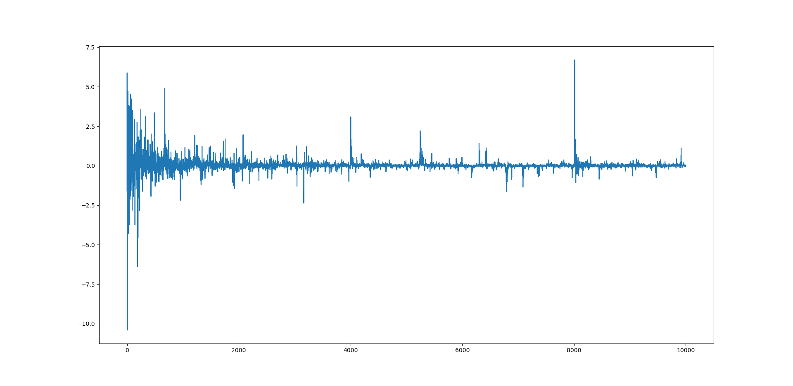

| 实验编号 | 实验内容             | 操作           | 结果      | 迭代次数 |
| -------- | -------------------- | -------------- | --------- | -- |
| 1        | 对照组               | [>>>](#对照组) | SSIM=0.70201 | 15000 |
| 2        | 去除第一个DenseBlock | [>>>](#实验组) | SSIM=0.7249 | 15000 |
| 3        | loss对照             | [>>>](#结果)   | --        | |

### 对照组

**操作**

```sh
# 运行指令
sh ./scripts/train_model_de.sh se 4 de  0 0.88
# 数据集	hs_SRS_de
# 模型	 se
```

**网络层**

```python
x_spec_conv = self.spec_conv(x)
x_spec_conv = self.block1(x_spec_conv)	# 第一个DenseBlock
x_spec_conv = self.down1(x_spec_conv)
x_spec_conv = self.se1(x_spec_conv)		# SELayer
x_spec_conv = self.block2(x_spec_conv)
x_spec_conv = self.down2(x_spec_conv)
```

### 实验组

**操作**

```sh
# 运行指令（与对照组相同）
sh ./scripts/train_model_de.sh se 4 de  0 0.88
```

**网络层**

```python
x_spec_conv = self.spec_conv(x)
# x_spec_conv = self.block1(x_spec_conv)	# 第一个DenseBlock
# x_spec_conv = self.down1(x_spec_conv)
x_spec_conv = self.se1(x_spec_conv)		# SELayer
x_spec_conv = self.block2(x_spec_conv)
x_spec_conv = self.down2(x_spec_conv)
```

### 结果



> loss之差：实验组-对照组

