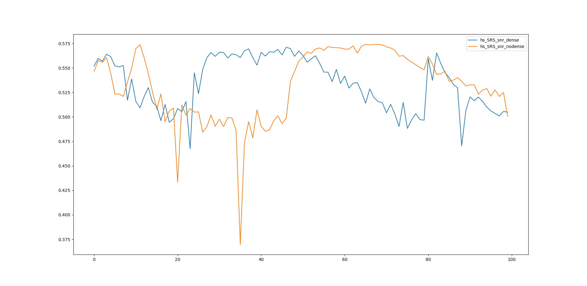

| 实验步骤   | 实验结果          | 存在问题 | 状态 |
| ---------- | ----------------- | -------- |-------- |
| 更改通道数 | [>>>](#更改通道数) | ---      | **<span style="color:green">已完成</span>** |
| ~~处理数据集~~ | [~~>>>~~](#处理数据集) | 没必要    | 已取消 |
| 解决bug | [>>>](#predict问题) | ~~predict过程有问题~~ [解决方案](#predict解决方法) | **<span style="color:green">已完成</span>** |
| 训练 | [>>>](#实验结果) | SSIM低，区别性不大 | 已完成 |


***

### 更改通道数

数据集使用`highSNR`和`lowSNR`，`channel`为5

```python
# bufferedpatchdataset.py
>>>>>>>>>>>>>>>>>>>>>>>>>>>
# final_channels = 128
final_channels = 5
>>>>>>>>>>>>>>>>>>>>>>>>>>>

# se.py
>>>>>>>>>>>>>>>>>>>>>>>>>>>
# starting_chan = 128
# final_chan = 128
starting_chan = 5
final_chan = 5
>>>>>>>>>>>>>>>>>>>>>>>>>>>
```

### 处理数据集

* ~~数据集中不存在tif，将png格式的GT图像转化为tif格式~~

* ~~原始GT图像为`200x200`，而signal是`5x200x200`~~
  
	* ~~处理方法：将GT矩阵扩展一个维度，复制出五个通道~~
	
	> `script/multiLayer.py`

### predict问题

**报错信息**

```sh
Traceback (most recent call last):
  File "predict.py", line 123, in <module>
    main()
  File "predict.py", line 109, in main
    prediction = model.predict(signal) if model is not None else None
  File "/root/final_net_se_de/fnet/fnet_model.py", line 123, in predict
    prediction = module(signal).cpu()
  File "/root/anaconda3/lib/python3.8/site-packages/torch/nn/modules/module.py", line 727, in _call_impl
    result = self.forward(*input, **kwargs)
  File "/root/final_net_se_de/fnet/nn_modules/se.py", line 126, in forward
    x_spec_conv = self.spec_conv(x)
  File "/root/anaconda3/lib/python3.8/site-packages/torch/nn/modules/module.py", line 727, in _call_impl
    result = self.forward(*input, **kwargs)
  File "/root/final_net_se_de/fnet/nn_modules/se.py", line 307, in forward
    x = self.conv1(x)
  File "/root/anaconda3/lib/python3.8/site-packages/torch/nn/modules/module.py", line 727, in _call_impl
    result = self.forward(*input, **kwargs)
  File "/root/anaconda3/lib/python3.8/site-packages/torch/nn/modules/conv.py", line 423, in forward
    return self._conv_forward(input, self.weight)
  File "/root/anaconda3/lib/python3.8/site-packages/torch/nn/modules/conv.py", line 419, in _conv_forward
    return F.conv2d(input, weight, self.bias, self.stride,
RuntimeError: Given groups=1, weight of size [100, 5, 3, 3], expected input[1, 4, 200, 200] to have 5 channels, but got 4 channels instead
```

### predict解决方法

**问题描述**：`predict.py`第22、23行**transform_signal**和**transform_target**加入了**propper**过程，图像经过此过程后从`5x200x200`变为`4x200x200`，通道减少导致后续计算出错

**解决方法**：去除propper过程


### 实验结果

| 实验编号 | 实验类型 | 操作      | SSIM   | 迭代次数 |
| -------- | -------- | --------- | ------ | -------- |
| 1        | 对照组   | 无        | 0.5048 | 10000    |
| 2        | 实验组   | 去除dense | 0.5007 | 10000    |

**ssim过程图**



